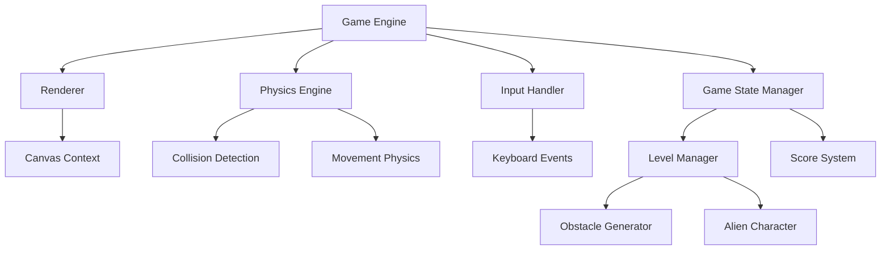

# Alien Jump Game Design Document

## Overview

The Alien Jump Game is a browser-based 2D platformer implemented in vanilla JavaScript using HTML5 Canvas for rendering. The game features a side-scrolling alien character that must navigate through a level by jumping over spike obstacles. The architecture emphasizes simplicity, performance, and maintainability while providing smooth gameplay mechanics.

## Architecture

### Core Components



### System Architecture

The game follows a component-based architecture with clear separation of concerns:

- **Game Loop**: Central update/render cycle running at 60 FPS
- **Entity System**: Manages game objects (alien, spikes, terrain)
- **Physics System**: Handles movement, gravity, and collision detection
- **Rendering System**: Manages all visual output to HTML5 Canvas
- **Input System**: Processes keyboard input and translates to game actions

## Components and Interfaces

### 1. Game Engine (`GameEngine`)

**Responsibilities:**
- Initialize game systems
- Manage the main game loop
- Coordinate between all subsystems
- Handle game state transitions

**Key Methods:**
```javascript
class GameEngine {
    init()           // Initialize all game systems
    start()          // Begin the game loop
    update(deltaTime) // Update all game logic
    render()         // Render current frame
    pause()          // Pause game execution
    reset()          // Reset game to initial state
}
```

### 2. Alien Character (`AlienCharacter`)

**Responsibilities:**
- Handle player movement and jumping
- Manage character animations
- Process collision responses
- Track character state (grounded, jumping, falling)

**Properties:**
- Position (x, y coordinates)
- Velocity (horizontal and vertical speed)
- Dimensions (width, height for collision)
- Animation state and frame tracking
- Ground detection flag

**Key Methods:**
```javascript
class AlienCharacter {
    update(deltaTime)     // Update position and animation
    jump()               // Initiate jump if grounded
    moveLeft()           // Move character left
    moveRight()          // Move character right
    checkCollisions()    // Handle obstacle collisions
    render(context)      // Draw character to canvas
}
```

### 3. Spike Obstacle (`SpikeObstacle`)

**Responsibilities:**
- Represent static hazardous obstacles
- Provide collision boundaries
- Render spike graphics with cross-browser compatibility

**Properties:**
- Position (x, y coordinates)
- Dimensions (width, height)
- Collision boundaries
- Visual representation (emoji with fallback options)
- Browser-compatible rendering system

**Visual Design Considerations:**
- Primary rendering using emoji characters for visual appeal
- Fallback to geometric shapes for browsers with poor emoji support
- Consistent visual representation across different platforms

### 4. Physics Engine (`PhysicsEngine`)

**Responsibilities:**
- Apply gravity to moving objects
- Handle collision detection between entities
- Manage movement physics and constraints

**Key Methods:**
```javascript
class PhysicsEngine {
    applyGravity(entity, deltaTime)
    checkCollision(entityA, entityB)
    resolveCollision(entity, obstacle)
    updatePosition(entity, deltaTime)
}
```

### 5. Level Manager (`LevelManager`)

**Responsibilities:**
- Generate and manage spike obstacle placement
- Ensure all obstacles are jumpable
- Handle level progression and boundaries

**Key Methods:**
```javascript
class LevelManager {
    generateLevel()           // Create obstacle layout
    validateJumpability()     // Ensure all spikes are clearable
    getObstaclesInRange(x, range) // Get nearby obstacles
    checkLevelCompletion()    // Detect if level is finished
}
```

## Data Models

### Game State
```javascript
const gameState = {
    isRunning: boolean,
    isPaused: boolean,
    score: number,
    level: number,
    gameTime: number
}
```

### Character State
```javascript
const characterState = {
    position: { x: number, y: number },
    velocity: { x: number, y: number },
    isGrounded: boolean,
    isJumping: boolean,
    animationFrame: number,
    facingDirection: 'left' | 'right'
}
```

### Level Configuration
```javascript
const levelConfig = {
    width: number,
    height: number,
    groundLevel: number,
    spikePositions: Array<{x: number, y: number}>,
    alienStartPosition: { x: number, y: number }
}
```

## Error Handling

### Collision System
- Graceful handling of edge cases in collision detection
- Fallback positioning when character gets stuck
- Validation of obstacle placement during level generation

### Performance Management
- Frame rate monitoring and adjustment
- Canvas context error handling
- Memory management for sprite loading and animation

### Input Validation
- Debouncing of rapid key presses
- Handling of simultaneous key combinations
- Graceful degradation if certain keys are unavailable

### Visual Rendering Compatibility
- **Emoji Fallback System**: Automatic detection of emoji rendering capabilities
- **Cross-browser Compatibility**: Alternative rendering methods for unsupported emoji
- **Consistent Visual Experience**: Ensure game remains playable regardless of emoji support
- **Performance Optimization**: Efficient rendering method selection based on browser capabilities

## Testing Strategy

### Unit Testing Focus Areas
1. **Physics Calculations**: Gravity application, jump mechanics, collision detection algorithms
2. **Level Generation**: Obstacle placement validation, jumpability verification
3. **Character Movement**: Position updates, boundary checking, state transitions
4. **Game State Management**: Pause/resume functionality, score tracking, level progression

### Integration Testing
1. **Game Loop Performance**: Verify consistent frame rates under various conditions
2. **Input Response**: Test keyboard input handling and character response timing
3. **Collision System**: Validate accurate collision detection between all entity types
4. **Level Completion**: Test full gameplay flow from start to finish

### Browser Compatibility Testing
- Test across major browsers (Chrome, Firefox, Safari, Edge)
- Verify Canvas API compatibility and performance
- Test keyboard event handling consistency
- Validate responsive behavior on different screen sizes
- **Emoji Compatibility**: Ensure all emoji characters render consistently across browsers
- Test fallback rendering for unsupported emoji characters

## Implementation Notes

### Jump Mechanics Design
The jump system uses a realistic physics model:
- Initial upward velocity applied when jump key is pressed
- Gravity constantly applied to reduce vertical velocity
- Variable jump height based on key press duration
- Coyote time allowing jumps shortly after leaving ground

### Obstacle Placement Algorithm
Spike obstacles are placed using a validation system:
1. Generate random positions within level boundaries
2. Calculate required jump distance and height for each spike
3. Verify alien's maximum jump capabilities can clear each obstacle
4. Adjust spacing between consecutive spikes if needed
5. Regenerate problematic sections until all spikes are jumpable

### Performance Optimizations
- Object pooling for frequently created/destroyed entities
- Culling of off-screen obstacles during rendering
- Efficient collision detection using spatial partitioning
- Sprite batching to minimize canvas draw calls